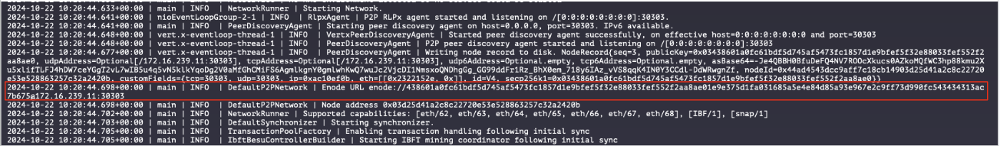

# Hyperledger Besu Private Blockchain Network

This project is a private blockchain network using Hyperledger Besu with IBFT 2.0 as the consensus mechanism. The network is composed of multiple nodes, each configured to validate and sync blocks. The goal is to set up a permissioned blockchain for secure, scalable, and reliable distributed ledger solutions. This network also demonstrates how to stop and restart nodes while ensuring synchronization across the network.

## Purpose

This network is designed to simulate a private blockchain where nodes can interact, synchronize, and validate blocks. It’s useful for testing purposes or as a foundation for private enterprise solutions where consensus needs to be reached without public mining.

Requirements

* Docker
* Docker Compose
* Hyperledger Besu image

## Run the Besus Network

For run the project and use it, you must just clone it and excute the first `docker-compose.yaml` to generate the keys and the genesis block

```bash
> cd genesis-generator
> docker-compose up
```

This generate a folder named `networkFiles` with the keys per each node, you must copy the `key` and the `key.pub` and paste these in the `/data` folder fo each node.

Next, you can access to each node and execute the `docker-compose up`, you can follow the steps below to know how was configured the network and attach the enode URL

**Have fun with your own network**

## Steps to Set Up the Network!

### 1. Generate the Genesis Block

The genesis block is the starting point of the blockchain and is configured in the ibftConfigFile.json. Run the following Docker Compose configuration to generate the genesis block:

```yaml
version: "3.9"
services:
  reltime_node:
    image: hyperledger/besu:latest
    container_name: "genesis-generator"
    volumes:
      - .:/usr/app/
    command: > 
      operator generate-blockchain-config 
      --config-file=/usr/app/ibftConfigFile.json 
      --to=/usr/app/networkFiles 
      --private-key-file-name=key
    logging:
      driver: "json-file"
      options:
        max-size: "10m"
        max-file: "3"
    labels:
      - "project=besu-network"
      - "service=genesis-generator"
```

### 2. Example ibftConfigFile.json

This file defines the initial state of the blockchain and configuration parameters for the IBFT 2.0 consensus.

```json
{
  "genesis": {
    "config": {
      "chainId": 15,
      "muirglacierblock": 0,
      "ibft2": {
        "blockperiodseconds": 2,
        "epochlength": 30000,
        "requesttimeoutseconds": 4
      }
    },
    "nonce": "0x0",
    "timestamp": "0x0",
    "gasLimit": "0x1fffffffffffff",
    "difficulty": "0x1",
    "mixHash": "0x63746963616c20626c6f636b20686561646572",
    "coinbase": "0x0000000000000000000000000000000000000000",
    "alloc": {
      "0xa0b86991c6218b36c1d19d4a2e9eb0ce3606eb48": {
        "balance": "1000000000000000000000000"
      },
      "0x742d35cc6634c0532925a3b844bc454e4438f44e": {
        "balance": "1000000000000000000000000"
      },
      "0xfe9e8709d3215310075d67e3ed32a380ccf451c8": {
        "balance": "1000000000000000000000000"
      }
    }
  },
  "blockchain": {
    "nodes": {
      "generate": true,
      "count": 3
    }
  }
}
```

### 3. Configure the Nodes

Each node runs as a Docker service. Below is the docker-compose.yaml example for Node-1. This file specifies the networking and ports for the node, as well as linking to the genesis and configuration files.

```yaml
services:
  node:
    image: hyperledger/besu:latest
    container_name: "node-1"
    volumes:
      - ./data:/usr/app/data
      - ./config.toml:/usr/app/config.toml
      - ./genesis.json:/usr/app/genesis.json
    command: --config-file=/usr/app/config.toml
    ports:
      - "8545:8545"   # RPC HTTP
      - "8546:8546"   # RPC WebSocket
      - "30303:30303" # P2P
      - "9545:9545"   # Metrics
      - "8888:8888"   # WebSocket RPC (custom port)
    networks:
      besu-net:
        ipv4_address: 172.16.239.11
    deploy:
      resources:
        limits:
          memory: 1G

networks:
  besu-net:
    external: true
```

### 4. config.toml Example for Node-1

This file configures the node, including its peer connections, RPC ports, and P2P settings. It defines the node’s bootnodes, private key, and other network settings.

**Important:** The enode URLs are an example, you need to get the enode URL and paste in the bootnode array

```toml
data-path="/usr/app/data"

bootnodes=[
    "enode://ad2014bf5d2524428a72e1a27379ec8ee5618664dcc65ba5925a711e9218ff7c87ea3820e2f1d87c97efbccfd9e54227ae9f08536feff365a81acddd00015728@172.16.239.12:30304",
    "enode://9462dec9fd31f7aeb74c58b49dc1173c464dc539e2c54fed81b55a39444814deb74ad7d602898d627889743217413f0de23e02f36e2a72b9e4f4e21f40a02ee1@172.16.239.13:30305",
    "enode://28210e05ad0527682cea67481a03a0f361ecf34427308cc141c8f89ec24fe471860b6b82559aad93f347c3ae11cc6c5f17ad39033c3f148ec4f7530c6f19e2e0@172.16.239.14:30306"
]

rpc-http-enabled=true
rpc-http-api=["ETH","NET","WEB3","IBFT"]
rpc-http-cors-origins=["all"]
p2p-port=30303
host-allowlist=["*"]
rpc-ws-enabled=true
rpc-ws-port=8888
metrics-port=9545
genesis-file="/usr/app/genesis.json"
metrics-enabled=true
node-private-key-file="/usr/app/data/key"
p2p-host="172.16.239.11"
```

### 5. Create the Enode URL

To create the Enode URL, we must to up the node, with the command `docker-compose up`, but first we must access to the **node-1** folder and execute the command before, in the logs response you can see the **enode URL**, you can attached attached image below



The format of the url look something like `enode://<public_key>@<node_ip>:<p2p_port>`

### 6. Check Node Synchronization

**Get the Block Number**

To check the current block number and see if the nodes are in sync, run:

```bash
curl -X POST --data '{"jsonrpc":"2.0","method":"eth_blockNumber","params":[],"id":1}' http://localhost:8545
```

**Get the Number of Connected Peers**

To check how many peers are connected to the node:

```bash
curl -X POST --data '{"jsonrpc":"2.0","method":"net_peerCount","params":[],"id":1}' http://localhost:8545
```

## Conclusion

This project showcases the setup of a private blockchain network using Hyperledger Besu with IBFT 2.0 consensus. Nodes can join, leave, and synchronize with the network, demonstrating the robustness of the consensus mechanism. Follow the steps above to verify the network status and ensure that all nodes are synchronized properly.